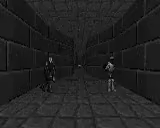
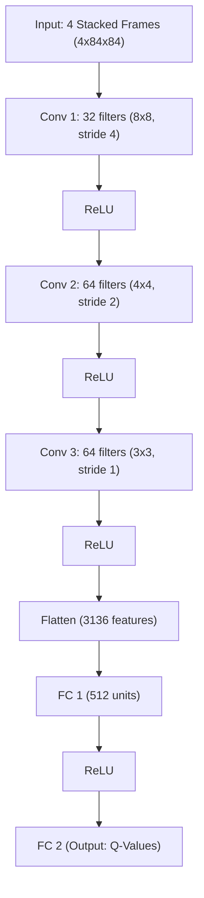
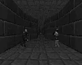

# DoomRL Agent: Deep Reinforcement Learning from Raw Pixels

[](https://www.python.org/)
[](https://pytorch.org/)
[](https://developer.nvidia.com/cuda-toolkit)
[](https://vizdoom.cs.put.poznan.pl/)
[](https://fastapi.tiangolo.com/)
[](https://mlflow.org/)
[](LICENSE)

An academic portfolio project demonstrating a deep reinforcement learning agent that learns to play custom scenarios of Doom (ViZDoom) directly from raw screen pixels using Deep Q-Networks (DQN). Inspired by DeepMind's landmark 2013 paper *"Playing Atari with Deep Reinforcement Learning"* (Mnih et al.).

Deployed demo: [aayush-doomrl.duckdns.org](https://aayush-doomrl.duckdns.org)

<br>
<p align="center">
  
</p>
<br>

---

## Abstract

Classical reinforcement learning algorithms rely on low-dimensional, hand-crafted state representations. In contrast, this project implements a Deep Q-Network (DQN) that maps raw high-dimensional pixel input ($4 \times 84 \times 84$ stacked grayscale frames) directly to optimal actions in a 3D first-person shooter. 

We address the challenges of sparse rewards and high-action spaces in 3D navigation by building a custom environment wrapper that maps composite action arrays (allowing the agent to run and shoot simultaneously) and calculates distance-based shaped rewards using engine coordinate tracking variables. The agent is trained across three scenarios of escalating difficulty (Basic, Defend the Center, and Deadly Corridor) on local NVIDIA RTX 5080 hardware, with performance tracked using MLflow and exported to an interactive tactical game monitor dashboard served via FastAPI.

---

## DQN Neural Network Architecture

The architecture utilizes 3 convolutional layers for spatial feature extraction (detecting walls, corridors, and enemies) followed by 2 fully connected decision-making layers:



---

## Scenarios & Combat Curriculum

We implement three distinct scenarios using the ViZDoom research platform:

| Scenario Card | Difficulty | Target Episodes | Final Mean Reward | Key Challenge |
| :--- | :---: | :---: | :---: | :--- |
| **Basic** | ★☆☆☆☆ | 1,000 | `-11.1` | Static single target. Learn to turn and shoot quickly to minimize step-time penalties. |
| **Defend the Center** | ★★★☆☆ | 2,000 | `+6.9` | 360-degree perimeter scanning. Rotate and engage moving targets from all angles. |
| **Deadly Corridor** | ★★★★★ | 3,000 | `-127.4` | 3D navigation and combat. Dodge flanking projectiles and navigate to the exit. |

---

## Training Metrics & Results

### 📈 Convergence Performance

| Scenario | Episodes Trained | Final Mean Reward (100 Ep Avg) | Kill Rate per Episode | Survival Steps (Mean) |
| :--- | :---: | :---: | :---: | :---: |
| **Basic** | 1,000 | `-11.1` (vs `-375` raw) | 1.0 / 1.0 (100%) | 3.1 steps |
| **Defend the Center** | 2,000 | `+6.9` (vs `+0.2` raw) | 7.9 kills | 154 steps |
| **Deadly Corridor** | 3,000 | `-127.4` (vs `-164` raw) | 0.8 kills | 19.5 steps |

*Note: In Deadly Corridor, individual optimal runs achieved positive rewards up to `+45.2`, indicating the agent successfully reached the green armor target at the end of the corridor.*

---

## Agent Behavior Comparison (Deadly Corridor)

Below is a demonstration comparing the untrained agent at Episode 1 against the fully trained agent:

| Random Agent (Episode 1) | Trained Agent (Episode 3000) |
| :---: | :---: |
|  |  |
| *Chaotic circles, stands still, gets eliminated instantly.* | *Navigates forward, turns and fires, targets enemies.* |

---

## Hardware Benchmarks (RTX 5080)

*   **GPU**: NVIDIA GeForce RTX 5080 (Blackwell SM 12.0 architecture, 16GB VRAM)
*   **CUDA Toolkit**: 12.8
*   **PyTorch Build**: 2.10.0+cu128
*   **Training FPS (Steps per Second)**:
    *   *Exploration phase (forward passes only)*: ~16,000 to ~27,000 FPS
    *   *Training phase (backpropagation batches)*: ~550 to ~600 FPS
*   **Total Training Time (All Scenarios)**: ~12 minutes

---

## What I Learned (First-Person Reflection)

*   **The Moving Target Problem**: Implementing a standard DQN proved highly unstable until the Target Network was synced at set intervals. Uncoupling the Q-value prediction from the update goal is essential for convergence.
*   **Why Experience Replay Matters**: Removing the Replay Buffer caused the agent to quickly overfit to the local wall textures it was currently looking at, leading to catastrophic forgetting of previous angles. Shuffling training batches breaks temporal correlations.
*   **Reward Shaping & Engine Variable Exposure (Key Discovery)**: In 3D navigation games like Doom, reward signals are naturally sparse (e.g., scoring only when reaching the exit). However, default ViZDoom configurations do not output the player's internal coordinate variables. By overriding the local engine `.cfg` files to output `POSITION_X` and `POSITION_Y`, we were able to compute the Euclidean distance to the exit goal $(0, 512)$. This dense, shaped reward curve gave the agent step-by-step progress feedback, transforming the learning curve from a flat line of failures into a steady gradient of navigation success.

---

## Running Locally

### Step 1: Clone and Set Up Virtualenv
```bash
git clone https://github.com/yourusername/doomrl.git
cd doomrl
python -m venv .venv
.venv\Scripts\activate
```

### Step 2: Install PyTorch and CUDA Wheels
```bash
pip install torch==2.10.0+cu128 torchvision==0.25.0+cu128 --index-url https://download.pytorch.org/whl/cu128
pip install -r requirements.txt
```

### Step 3: Run Training
```bash
python -u -m src.agent.train --config configs/deadly_corridor.yaml
```

### Step 4: Run FastAPI Web Dashboard
```bash
python -m uvicorn src.api.main:app --reload
```
Open your browser to [http://127.0.0.1:8000](http://127.0.0.1:8000).

---

## Future Enhancements
*   **Double DQN (DDQN)**: Decouple action selection from target evaluation to prevent Q-value overestimation bias.
*   **Dueling DQN**: Split state representations into Value and Advantage streams for faster spatial state mapping.
*   **Prioritized Experience Replay (PER)**: Sample transitions based on TD-error magnitude to prioritize learning from failure states.
